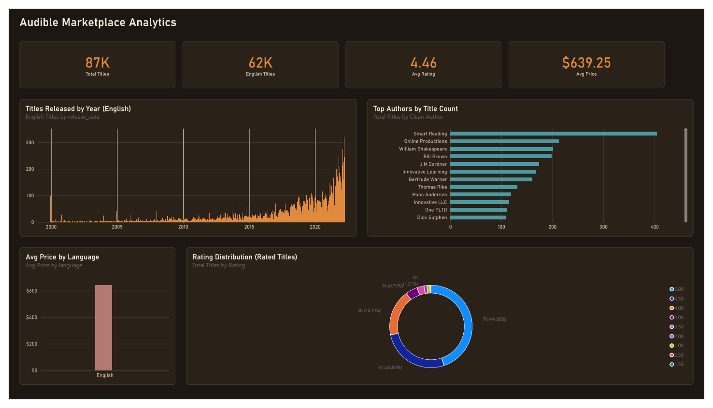

# 🎧 Audible Marketplace: End-to-End Data Cleaning & Market Analytics

*One of my first data projects (May 2026).*

## 📌 Project Overview
This project targets a massive, raw web-scraped dataset containing **87,489 audiobook records** originally pulled from the Audible.in marketplace. The raw file arrived with severe data formatting issues, structural overlaps, and text anomalies typical of automated web-scraping extraction.

The cleaning below was originally done by hand in Excel (`data/Audible_Uncleaned_Dashboard.xlsx` → `data/Audible_Cleaned_Dashboard.xlsx`); a Power BI dashboard (below) now covers the resulting analysis.

---

## 🛠️ Data Engineering & Cleaning Log
The source file was roughly **12 MB** and required a precise, multi-stage sanitization workflow to achieve downstream database and dashboard integrity:

1. **System Metadata Pruning:** Every row in the author and narrator columns was corrupted with hardcoded web tags (`Writtenby:` and `Narratedby:`). These layout artifacts were globally stripped across all 87k records using mass text replacement (`Cmd + H` -> Replace with Null).
2. **Algorithmic Name Repairing:** First and last names were smashed back-to-back without spacing (e.g., `AndyWeir`). By anchoring pattern rules manually for the first few entries, Excel’s pattern-recognition **Flash Fill (`Cmd + E`)** was deployed to instantly insert spaces across the massive column.
3. **Delimiter Extraction & Triage:** Certain records experienced an extraction glitch that duplicated name values across a comma boundary (e.g., `iMinds, iMinds` or `A.Haleem, A.Haleem`). This was fixed using the **Text-to-Columns** parsing wizard to split the data at the comma delimiter and discard the redundant secondary segments.
4. **Encoding Optimization (Mojibake Fix):** International audiobook listings (Japanese, Russian, German) suffered from heavy character-encoding corruption, rendering names into broken Unicode glyphs. A Power Query step (`Clean Author`, in the dashboard's semantic model) now catches what the manual Excel pass missed — it rejects any author string that isn't at least 85% Latin-script characters starting with an uppercase letter, so corrupted names drop out of the "Top Authors" chart instead of polluting it.
5. **Temporal Standardization:** Raw release dates were unorganized and mismatched. They were standardized into a uniform European date format (`DD/MM/YY`) and sorted sequentially from oldest to newest to provide a stable, chronological analysis timeline.
6. **Advanced Text-to-Numeric Parsing:** The audiobook duration (`time`) column was locked as a string data type combining irregular text formats (e.g., `11 hrs and 31 mins`, `3 hrs`, `23 mins`). To allow for mathematical calculation, nested logical formulas were written using `SEARCH`, `LEFT`, and `MID` to isolate standalone integers for hours and minutes, compiling them into a final column: `Total_Minutes`.
7. **Financial Data Conversion:** Raw retail prices contained currency markers and commas (e.g., `$1,519`), which Excel read as text strings. A nested conditional formula was applied (`=IF(Price="Free", 0, VALUE(...))`) to strip out text markers and create a clean numeric field (`Price_Numeric`) set to Currency format.

---

## 🖥️ The Dashboard

`audiobook_cleaning_data.pbip` (open with Power BI Desktop — File → Open →
the `.pbip` file; it pulls straight from `data/Audible_Cleaned_Dashboard.xlsx`).
Single dark dashboard page, Bahnschrift throughout.



A static export (`audiobook_cleaning_data.png`) lives alongside the `.pbip`
for anyone without Power BI Desktop.

**KPI strip:** Total Titles, English Titles, Avg Price, and Avg Rating.
Below that: price by language, a rating-distribution donut, titles by
release year, and Top Authors by title count — the chart the `Clean
Author` cleanup step above exists for.

## 📂 Structure
```
data/
  Audible_Uncleaned_Dashboard.xlsx   raw scrape
  Audible_Cleaned_Dashboard.xlsx     cleaned (per the log above)
audiobook_cleaning_data.pbip             Power BI project (open in Desktop)
audiobook_cleaning_data.Report/          PBIR: pages, visuals as JSON
audiobook_cleaning_data.SemanticModel/   TMDL: tables, measures
audiobook_cleaning_data.png              static export of the dashboard
```
