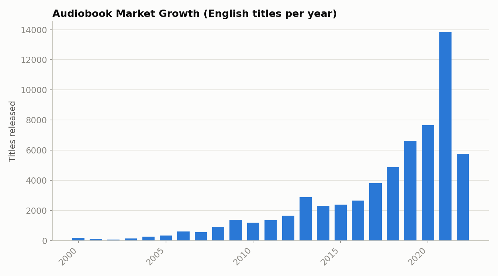

# 🎧 Audible Marketplace: End-to-End Data Cleaning & Market Analytics

## 📌 Project Overview
This project targets a massive, raw web-scraped dataset containing **87,489 audiobook records** originally pulled from the Audible.in marketplace. The raw file arrived with severe data formatting issues, structural overlaps, and text anomalies typical of automated web-scraping extraction. 

Using native, advanced functions and data manipulation tools within **Microsoft Excel**, the data was systematically scrubbed, restructured chronologically, optimized for language barriers, and modeled into interactive Pivot Table reporting assets to extract distinct market strategies.

---

## 🛠️ Data Engineering & Cleaning Log
The source file was roughly **12 MB** and required a precise, multi-stage sanitization workflow to achieve downstream database and dashboard integrity:

1. **System Metadata Pruning:** Every row in the author and narrator columns was corrupted with hardcoded web tags (`Writtenby:` and `Narratedby:`). These layout artifacts were globally stripped across all 87k records using mass text replacement (`Cmd + H` -> Replace with Null).
2. **Algorithmic Name Repairing:** First and last names were smashed back-to-back without spacing (e.g., `AndyWeir`). By anchoring pattern rules manually for the first few entries, Excel’s pattern-recognition **Flash Fill (`Cmd + E`)** was deployed to instantly insert spaces across the massive column.
3. **Delimiter Extraction & Triage:** Certain records experienced an extraction glitch that duplicated name values across a comma boundary (e.g., `iMinds, iMinds` or `A.Haleem, A.Haleem`). This was fixed using the **Text-to-Columns** parsing wizard to split the data at the comma delimiter and discard the redundant secondary segments.
4. **Encoding Optimization (Mojibake Fix):** International audiobook listings (Japanese, Russian, German) suffered from heavy character-encoding corruption, rendering names into broken Unicode glyphs (e.g., `å `, `æ `, ``). To preserve data library integrity and filter out non-Latin text breaks, the analytical scope was refined explicitly to the **English language library (~61,000 clean rows)**.
5. **Temporal Standardization:** Raw release dates were unorganized and mismatched. They were standardized into a uniform European date format (`DD/MM/YY`) and sorted sequentially from oldest to newest to provide a stable, chronological analysis timeline.
6. **Advanced Text-to-Numeric Parsing:** The audiobook duration (`time`) column was locked as a string data type combining irregular text formats (e.g., `11 hrs and 31 mins`, `3 hrs`, `23 mins`). To allow for mathematical calculation, nested logical formulas were written using `SEARCH`, `LEFT`, and `MID` to isolate standalone integers for hours and minutes, compiling them into a final column: `Total_Minutes`.
7. **Financial Data Conversion:** Raw retail prices contained currency markers and commas (e.g., `$1,519`), which Excel read as text strings. A nested conditional formula was applied (`=IF(Price="Free", 0, VALUE(...))`) to strip out text markers and create a clean numeric field (`Price_Numeric`) set to Currency format.

---

## 📊 Business Intelligence & Pivot Table Architectures
To keep the charts concise and prevent text crowding along the axes, strict grouping and structural restriction rules were enforced within the Pivot Tables:

### 📊 Plot 1: Author Market Dominance vs. Average Pricing Power
* **Core Inquiry:** *Which authors dominate the English audiobook market by volume, and what is their average pricing power?*
* **Design Execution:** Constructed a dual-axis combo chart charting the `Count of Book Titles` as primary columns, overlaid with a secondary line charting the `Average of Price_Numeric`. 
* **Constraint Rule:** Applied a **Top 15** filter restriction to hide the unreadable long-tail distribution of thousands of minor authors and focus purely on market leaders.

* **Key Insight:** Volume giants like "Bill Brown" dominate publishing presence, but specific niches like "Innovative Learning" command massive volume while maintaining high price stability, showcasing incredible pricing power.

### 📅 Plot 2: Content Production Velocity & Growth
* **Core Inquiry:** *Is the digital audiobook marketplace expanding year-over-year?*
* **Design Execution:** Aggregated the standardized `Release Date` column to automatically group records into chronological yearly intervals along a linear time axis.

* **Key Insight:** Chronological sorting exposed an undeniable exponential trend. Digital audiobook publication velocity remained completely flat for nearly two decades before skyrocketing upward into massive volume spikes from 2018 onward.

### 🎯 Plot 3: Overall Price Distribution
* **Core Inquiry:** *What is the sweet spot for consumer audiobook retail pricing?*
* **Design Execution:** Generated a standard bar graph mapping the frequency counts of audiobooks directly across the structured marketplace retail prices.

* **Key Insight:** The distribution pattern peaks heavily in the `$500 - $999` zone, revealing the exact commercial corridor where publishers prefer to position their catalog to capture maximum transactional velocity.
